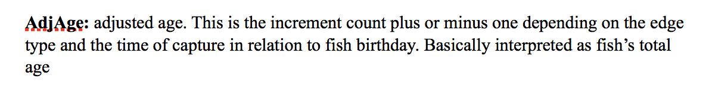
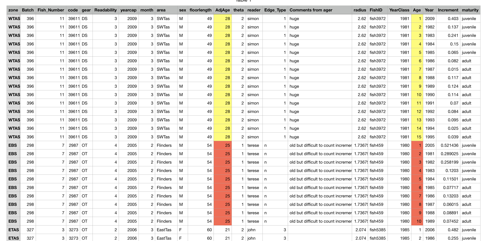

---

output: html_document
---

```{r setup, include=FALSE}
knitr::opts_chunk$set(echo = TRUE)
```

Hello,

After some preliminary analysis of the dataset I have one question to ask in regards to the 'AdjAge' variable within the dataset.

From what I understand 'AdjAge' is a measure of the overall age of the fish when caught (as stated in Federico's original explanatory notes, as shown below).

``````{r, echo=FALSE, fig.cap="Federico's original notes on AdjAge", out.width = '75%'}

```

From this statement I expect only deviations of 1 between the final 'Age' value and the 'AdjAge'. However, as shown in the original dataset below, for older individuals these values 
do no show this pattern. As seen from the dataset, a value of 28 for AdjAge is applied to an individual which only has counts to 15 years of age when caught. A similar pattern is 
shown for other individuals as well.

``````{r, echo=FALSE, fig.cap="The datasheet-highlighted cells indicate the query", out.width = '100%'}

```

Furthermore the Australian government's fishery page (https://www.afma.gov.au/fisheries-management/species/tiger-flathead) states that the Tiger Flathead typically only lives up to 15 years old.

I am just wondering where these values for 'AdjAge' for older individuals come from 
